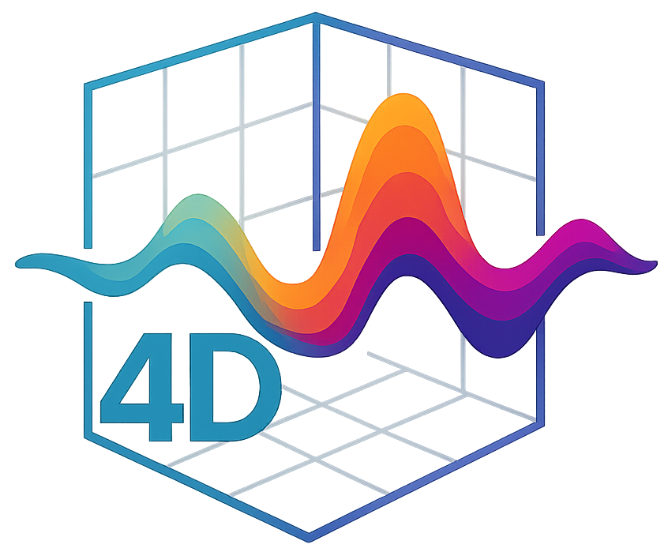
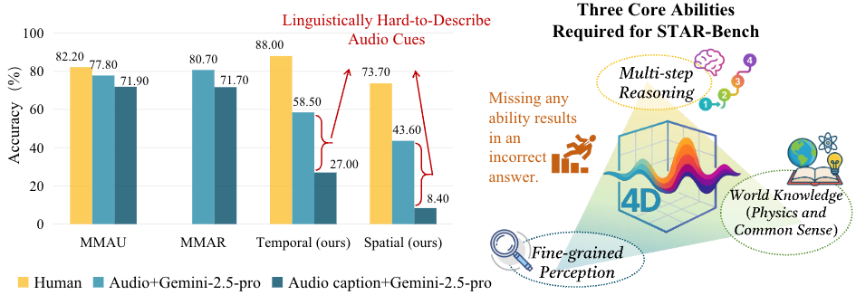
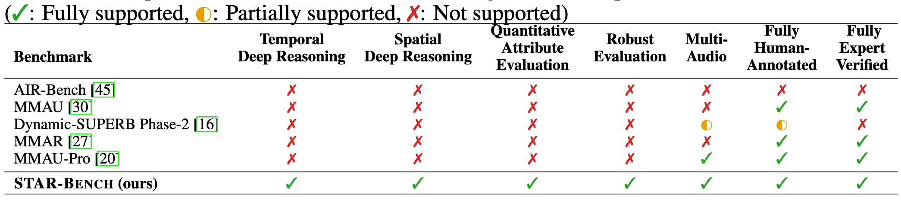
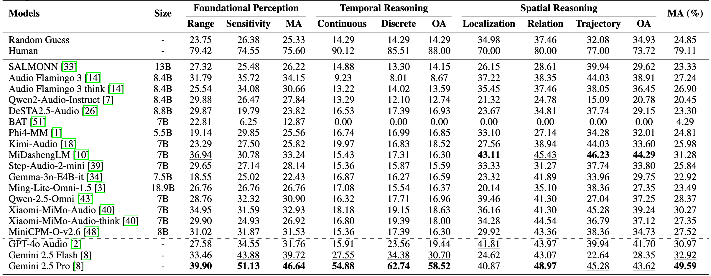
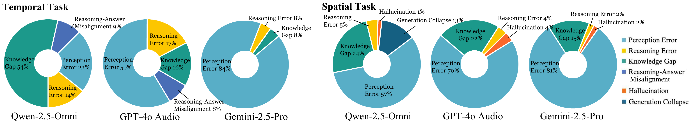
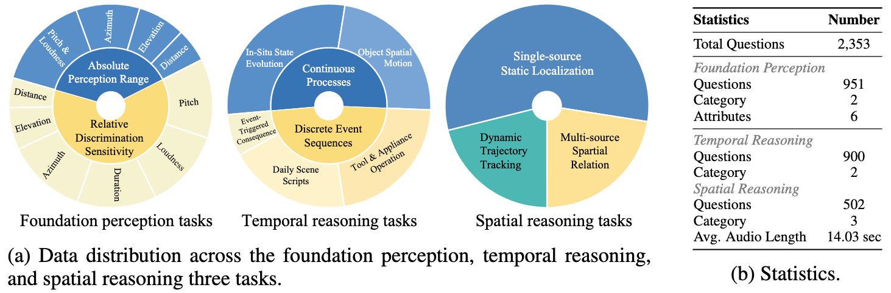
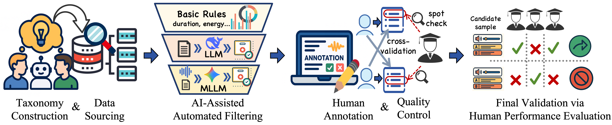

<div align="center">
  <h1 align="center">
    <div style="display: flex; align-items: center; justify-content: center;">
      
      <div style="text-align: left; line-height: 1.3;">
        STAR-Bench: Probing Deep Spatio-Temporal Reasoning as Audio 4D Intelligence
      </div>
    </div>
  </h1>
  <p align="center">
    <a href="https://scholar.google.com/citations?user=iELd-Q0AAAAJ"><strong>Zihan Liu<sup>*</sup></strong></a>
    ·
    <a href="https://scholar.google.com/citations?user=mXSpi2kAAAAJ&hl=zh-CN"><strong>Zhikang Niu<sup>*</sup></strong></a>
    ·
    <a href="https://github.com/akkkkkkkkki/"><strong>Qiuyang Xiao</strong></a>
    ·
    <a href="https://scholar.google.com/citations?user=WYwBrzAAAAAJ&hl=en"><strong>Zhisheng Zheng</strong></a>
    ·
    <a href="https://github.com/yrqqqq404"><strong>Ruoqi Yuan</strong></a>
    ·
    <a href="https://yuhangzang.github.io/"><strong>Yuhang Zang<sup>&dagger;</sup></strong></a>
    </br>
    <a href="https://scholar.google.com/citations?user=sJkqsqkAAAAJ"><strong>Yuhang Cao</strong></a>
    ·
    <a href="https://lightdxy.github.io/"><strong>Xiaoyi Dong</strong></a>
    ·
    <a href="https://scholar.google.com/citations?user=P4yNnSkAAAAJ&hl=zh-TW"><strong>Jianze Liang</strong></a>
    ·
    <a href="https://scholar.google.com/citations?user=d6u01FkAAAAJ&hl=en"><strong>Xie Chen</strong></a>
    ·
     <a href="https://scholar.google.com/citations?user=QVHvhM4AAAAJ&hl=en"><strong>Leilei Sun</strong></a>
    ·
     <a href="http://dahua.site/"><strong>Dahua Lin</strong></a>
    ·
     <a href="https://myownskyw7.github.io/"><strong>Jiaqi Wang<sup>&dagger;</sup></strong></a>
  </p>
  <p align="center" style="font-size: 1em; margin-top: -1em"> <sup>*</sup>  Equal Contribution. <sup>&dagger;</sup>Corresponding authors. </p>
  <p align="center" style="font-size: 1.2em; margin-top: 0.5em">
    📖<a href="https://arxiv.org/abs/2510.24693">arXiv</a> |
    🌐<a href="https://internlm.github.io/StarBench/">Homepage</a>
  | 🤗<a href="https://huggingface.co/datasets/internlm/STAR-Bench">Dataset</a>
  </p> 
</div>


## 📢 News
- 🚀 [10/28/2025] We have released the STAR-Bench 🏠[repository](https://github.com/InternLM/StarBench) and 🌐[homepage](https://internlm.github.io/StarBench/).
- 🚀 [10/28/2025] STAR-Bench v1.0 is now available on 🤗[HuggingFace](https://huggingface.co/datasets/internlm/STAR-Bench)!
    
    Compared with v0.5 (introduced in our arXiv paper), v1.0 features revised and refined Questions & Answers for improved clarity and quality for spatial tasks. 
    📌 Please cite this version (v1.0) when reporting results going forward.
    The leaderboard will be updated soon.
   


## 🌈Overview

We formalize <strong>audio 4D intelligence</strong> that is defined as reasoning over sound dynamics in time and 3D space, and introduce a <strong>STAR-Bench</strong> to measure it. STAR-Bench combines a <strong>Foundational Acoustic Perception</strong>setting (six attributes under absolute and relative regimes) with a <strong>Holistic Spatio-Temporal Reasoning</strong> setting that includes segment reordering for continuous and discrete processes and spatial tasks spanning static localization, multi-source relations, and dynamic trajectories.
<p style="text-align: center;"> 
   
</p>
Unlike prior benchmarks where caption-only answering reduces accuracy slightly, STAR-Bench induces far larger drops (-31.5\% temporal, -35.2\% spatial), evidencing its focus on <strong>linguistically hard-to-describe cues</strong>. 
Evaluating 19 models reveals substantial gaps to humans and a capability hierarchy. Our STAR-Bench provides critical insights and a clear path forward for developing future models with a more robust understanding of the physical world. 

Benchmark examples are illustrated below. You can also visit the 🌐[homepage](https://internlm.github.io/StarBench/) for a more intuitive overview.
</p>
<p style="text-align: center;"> 
   
</p>
  
<!-- A comparative overview of our benchmark against other representative audio benchmarks is shown below.
<p style="text-align: center;"> 
 
</p>  -->


## 📊Results and Analysis
Evaluation results of various models on STAR-Bench v0.5 are shown below.
The leaderboard for v1.0 will be released soon.
<p style="text-align: center;">
  
</p>
Error distribution across temporal and spatial Tasks:
<p style="text-align: center;">
  
</p>

## 💡 Key Insights
- 🔥**A clear capability hierarchy between the two groups.** Closed-source models are bottlenecked by fine-grained perception, while open-source models lag across perception, knowledge, and reasoning. 
- 🔥 **Enhancing dense audio captioning.** Open-source models struggle to produce dense, fine-grained captions, which limits their perceptual sensitivity and ability to extract embedded knowledge. Bridging this gap is a crucial first step. 
- 🔥 **Improving multi-audio reasoning.** Open-source models lag significantly in comparing, integrating, and grounding information across multiple audio clips. 
- 🔥 **Moving beyond channel-averaged audio preprocessing.** The common practice of averaging multi-channel audio into a mono signal is a major bottleneck for spatial reasoning. Developing architectures that natively process multi-channel cues is essential for unlocking genuine spatial awareness.


## ⚙️Data Curation
<p style="text-align: center;">
 
</p>
 All audio for the foundational perception task is synthesized using precise parameterization or the Pyroomacoustics physics-based simulator, providing complete control over acoustic parameters. Domain experts rigorously validate the task difficulty
levels, which are then calibrated through human testing.</br>
For the holistic spatio-temporal reasoning task, the curation process comprises four key stages, including human annotation and final selection based on human performance, as illustrated below.
<p style="text-align: center;">
   
</p>

## 🛠️ Test Your Model!
The `ALMEval_code/` is partially adapted from [VLMEvalKit](https://github.com/open-compass/VLMEvalKit) and [Kimi-Audio-Evalkit](https://github.com/MoonshotAI/Kimi-Audio-Evalkit).  
It provides a unified evaluation pipeline for multimodal large models on **STAR-Bench**.


**Step 1: Prepare Environment**

```bash
git clone https://github.com/InternLM/StarBench.git
cd StarBench
conda create -n starbench python==3.10.0
conda activate starbench

# Install PyTorch (choose the correct CUDA version for your system)
pip3 install torch torchvision torchaudio --index-url https://download.pytorch.org/whl/cu126
pip install transformers==4.57.1
pip install accelerate
#NOTE! For more packages, see requirements.txt!!!
pip install -r requirements.txt
# (Optional) Install Flash-Attention for faster inference
pip install flash-attn --no-build-isolation
cd ALMEval_code
```

**Step 2: Get STAR-Bench v1.0 Dataset**

Download STAR-Bench v1.0 dataset from 🤗[HuggingFace](https://huggingface.co/datasets/internlm/STAR-Bench)
```bash
huggingface-cli download --repo-type dataset --resume-download internlm/STAR-Bench --local-dir your_local_data_dir 

```

**Step 3: Set Up Your Model for Evaluation**

Currently supported models include: `Qwen2.5-Omni`, `Qwen2-Audio-Instruct`, `DeSTA2.5-Audio`, `Phi4-MM`, `Kimi-Audio`, `MiDashengLM`, `Step-Audio-2-mini`, `Gemma-3n-E4B-it`, `Gemini` and `GPT-4o Audio`.
<!-- `Ming-Lite-Omni-1.5`,`Xiaomi-MiMo-Audio`,`MiniCPM-O-v2.6`,`Audio Flamingo 3`, -->

To integrate a new model, create a new file `yourmodel.py` under the `models/` directory and implement the function generate_inner().

✅ Example: generate_inner()
```
def generate_inner(self, msg):
    """
    Args:
        msg: dict, input format as below
    """
    msg = {
        "meta": {
            "id": ...,
            "task": ...,
            "category": ...,
            "sub-category": ...,
            "options": ...,
            "answer": ...,
            "answer_letter": ...,
            "rotate_id": ...,
        },
        "prompts": [
            {"type": "text", "value": "xxxx"},
            {"type": "audio", "value": "audio1.wav"},
            {"type": "text", "value": "xxxx"},
            {"type": "audio", "value": "audio2.wav"},
            ...
        ]
    }
    # Return the model's textual response
    return "your model output here"
```
  
**Step 4: Configure Model Settings**

Modify the configuration file: `/models/model.yaml`.

For existing models, you may need to update parameters such as `model_path` to match your local model weight path.

To add a new model variant, follow these steps:
  1. Create a new top-level key for your alias (e.g., 'my_model_variant:').
  2. Set 'base_model' to the `NAME` attribute of the corresponding Python class.
  3. Add any necessary arguments for the class's `__init__` method under `init_args`.

Example:
```
qwen25-omni:
  base_model: qwen25-omni
  init_args:
    model_path: your_model_weight_path_here
```

**Step 5: Run Evaluation**

Run the following command:

```bash
#Single GPU
python ./run.py \
  --model qwen25-omni \
  --data starbench_default \
  --dataset_root your_local_data_dir  \
  --work-dir ./eval_results

#Multi-GPU (Distributed)
torchrun --nproc-per-node=8  ./run.py \
  --model qwen25-omni \
  --data starbench_default \
  --dataset_root your_local_data_dir  \
  --work-dir ./eval_results
```

Evaluation results will be automatically saved to the ./eval_results directory.

You can also evaluate specific subtasks or their combinations by modifying the `--data` argument.
The full list of available task names can be found in
`ALMEval_code/datasets/__init__.py.`

Example: Evaluate only the temporal reasoning and spatial reasoning tasks:
```
python ./run.py \
  --model qwen25-omni \
  --data tr sr \
  --dataset_root your_local_data_dir  \
  --work-dir ./eval_results
```

## ✒️Citation
```
@article{liu2025starbench,
  title={STAR-Bench: Probing Deep Spatio-Temporal Reasoning as Audio 4D Intelligence}, 
  author={Liu, Zihan and Niu, Zhikang and Xiao, Qiuyang and Zheng, Zhisheng and Yuan, Ruoqi and Zang, Yuhang and Cao, Yuhang and Dong, Xiaoyi and Liang, Jianze and Chen, Xie and Sun, Leilei and Lin, Dahua and Wang, Jiaqi},
  journal={arXiv preprint arXiv:2510.24693},
  year={2025}
}
```

## 📄 License
  **Usage and License Notices**: The data and code are intended and licensed for research use only.

## Acknowledgement
We sincerely thank <a href="https://www.2077ai.com/">2077AI</a> for providing the platform that supported our data annotation, verification, and review processes.


